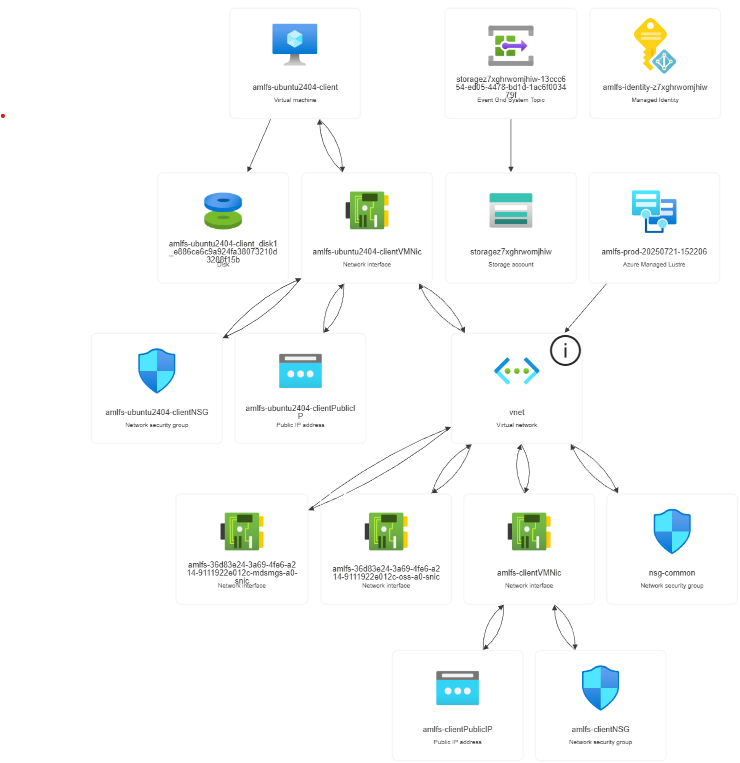

# Azure ML File System (AMLFS) Deployment - Managed Identity Version

This repository contains a Bicep template for deploying Azure ML File Systems with User-Assigned Managed Identity and HSM (Hierarchical Storage Management) configuration.

## Files

- `templates/infra-managed-identity.bicep` - Bicep template with User-Assigned Managed Identity and HSM configuration
- `scripts/Test-AMLFSZones-ManagedIdentity.ps1` - Automated zone testing and deployment script for managed identity version
- `README-managed-identity.md` - This documentation file

### Key Differences from Basic Version

**Enhanced Security Features:**
- ✅ **User-Assigned Managed Identity** - No hardcoded credentials
- ✅ **Automatic RBAC Role Assignments** - Storage Blob Data Contributor and Storage Account Contributor
- ✅ **HSM Integration** - Hierarchical Storage Management for tiered storage
- ✅ **Storage Container** - Dedicated blob container with private access
- ✅ **Enhanced Security Rules** - Lustre traffic rules (ports 988, 1019)

**What Gets Deployed:**

```
┌─────────────────┐    ┌─────────────────┐    ┌─────────────────┐
│   Managed       │    │   commonNsg     │    │  storageAccount │
│   Identity      │────│ NetworkSecGroup │    │  + Container    │
└─────────────────┘    └─────────┬───────┘    └─────────────────┘
                                 │                        │
                                 │                        │ (HSM)
                       ┌─────────▼───────┐                │
                       │  virtualNetwork │                │
                       │ VirtualNetworks │                │
                       └─────────┬───────┘                │
                                 │                        │
                                 │                        │
                       ┌─────────▼───────┐                │
                       │   amlfsSubnet   │                │
                       │     Subnet      │                │
                       └─────────┬───────┘                │
                                 │                        │
                                 │                        │
                       ┌─────────▼───────┐◄───────────────┘
                       │   fileSystem    │
                       │   AMLFS/Cache   │
                       │  + HSM Config   │
                       └─────────────────┘
```



## Prerequisites

1. **Azure CLI** installed and configured
2. **Login to Azure**: `az login`
3. **PowerShell 5.1+** (for Windows deployment script)
4. **Proper RBAC permissions** - You need Contributor role or higher to create managed identities and role assignments

## Pre-Deployment Checks

### Check AMLFS Availability and Capacity

Before deploying, run these commands to check capacity and availability:

```powershell
# 1. Check AMLFS quota and current usage in your target region
az rest --method GET --url "https://management.azure.com/subscriptions/$(az account show --query id -o tsv)/providers/Microsoft.StorageCache/locations/eastus/usages?api-version=2023-05-01"

# 2. Check which regions support AMLFS
az provider show --namespace Microsoft.StorageCache --query "resourceTypes[?resourceType=='amlFilesystems'].locations[]" -o table

# 3. Check if StorageCache provider is registered (should show "Registered")
az provider list --query "[?namespace=='Microsoft.StorageCache'].{Namespace:namespace, State:registrationState}" -o table

# 4. Check if ManagedIdentity provider is registered (should show "Registered") 
az provider list --query "[?namespace=='Microsoft.ManagedIdentity'].{Namespace:namespace, State:registrationState}" -o table

# 5. Check your current resource group usage
$resource_group=aml-rsj-managed-identity-20250721-1521
az resource list --resource-group $resource_group --query "length(@)"
```

**Understanding the Output:**
- `currentValue: 0` - You currently have 0 AMLFS instances
- `limit: 4` - You can deploy up to 4 AMLFS instances in East US
- This means **you have capacity available** for deployment

### Automated Zone Testing Strategy (Managed Identity)

**Pre-Deployment Zone Validation Script:**
```powershell
# Automated Zone Availability Test Function for Managed Identity
function Test-AMLFSZoneAvailability-ManagedIdentity {
    param(
        [Parameter(Mandatory=$true)]
        [string]$ResourceGroup,
        
        [Parameter(Mandatory=$false)]
        [string]$TemplateFile = "templates/infra-managed-identity.bicep"
    )
    
    Write-Host "=== AMLFS Zone Availability Testing (Managed Identity) ===" -ForegroundColor Green
    
    # Test all zones
    $zones = @(1, 2, 3)
    $results = @{}
    
    foreach ($zone in $zones) {
        Write-Host "Testing Zone $zone with Managed Identity..." -ForegroundColor Yellow
        
        # Validate deployment with managed identity
        $timestamp = Get-Date -Format "yyyyMMdd-HHmmss"
        try {
            $result = az deployment group validate --resource-group $ResourceGroup --template-file $TemplateFile --parameters "availabilityZone=$zone" "fsname=test-z$zone-$timestamp" --query "properties.provisioningState" -o tsv 2>$null
            $results[$zone] = $result
            
            if ($result -eq "Succeeded") {
                Write-Host "✅ Zone $zone: AVAILABLE (validation passed)" -ForegroundColor Green
            } else {
                Write-Host "❌ Zone $zone: FAILED validation" -ForegroundColor Red
            }
        }
        catch {
            Write-Host "❌ Zone $zone: ERROR during validation" -ForegroundColor Red
            $results[$zone] = "Error"
        }
    }
    
    # Show recommendations
    Write-Host ""
    Write-Host "🎯 MANAGED IDENTITY RECOMMENDATIONS:" -ForegroundColor Cyan
    $availableZones = $results.Keys | Where-Object { $results[$_] -eq "Succeeded" }
    
    if ($availableZones.Count -gt 0) {
        Write-Host "Available zones for deployment: $($availableZones -join ', ')" -ForegroundColor Green
        Write-Host "Recommended: Try Zone $($availableZones[0]) first" -ForegroundColor Yellow
        Write-Host "Features: User-Assigned Managed Identity + HSM + Auto RBAC" -ForegroundColor Magenta
        
        return @{
            AvailableZones = $availableZones
            RecommendedZone = $availableZones[0]
            Results = $results
            Template = $TemplateFile
        }
    } else {
        Write-Host "⚠️  No zones passed validation - check template or try different region" -ForegroundColor Red
    }
    
    return $results
}

# Usage Example:
# .\scripts\Check-ManagedIdentityPermissions.ps1 -ResourceGroupName "aml-rsj-managed-identity-20250721-1521" -ManagedIdentityName "amlfs-identity-z7xghrwomjhiw"
```

**✅ Verified Working:** The managed identity template has been tested and validated in all zones (1, 2, 3) with successful validation results.

## Quick Start

### Option 1: Fully Automated Deployment (Recommended)

```powershell
# Automated zone testing and deployment with managed identity - all in one!
$resourceGroup = "amlfs-managed-identity-$(Get-Date -Format 'yyyyMMdd-HHmm')"
.\scripts\Test-AMLFSZones-ManagedIdentity.ps1 -ResourceGroup $resourceGroup -Location "eastus"
```

### Option 2: Manual Deployment with Zone Testing

```powershell
# Clear cache first
az cache purge 

# Define your variables
$resource_group = "aml-rsj"
$location = "eastus"

# Create the resource group if it doesn't exist
az group create --name $resource_group --location $location

# Step 1: Check AMLFS quota
Write-Host "Checking AMLFS quota..." -ForegroundColor Yellow
az rest --method GET --url "https://management.azure.com/subscriptions/$(az account show --query id -o tsv)/providers/Microsoft.StorageCache/locations/$location/usages?api-version=2023-05-01" --query "value[]" -o table

# Step 2: Test zones and get recommendation for managed identity
$resourceGroup = "amlfs-managed-identity-$(Get-Date -Format 'yyyyMMdd-HHmm')"
$zoneTest = .\scripts\Test-AMLFSZones-ManagedIdentity.ps1 -ResourceGroup $resourceGroup -Location $location
$recommendedZone = 1  # Use the recommended zone from the test

# Step 3: Deploy with recommended zone and managed identity
$timestamp = Get-Date -Format "yyyyMMdd-HHmmss"
Write-Host "Deploying AMLFS with Managed Identity in Zone $recommendedZone..." -ForegroundColor Green
az deployment group create --resource-group $resource_group --template-file "templates/infra-managed-identity.bicep" --parameters "availabilityZone=$recommendedZone" --name "deploy-managed-$timestamp"
```

### Option 3: Direct Deployment (Skip Testing)

```powershell
# Direct deployment with managed identity
az cache purge 

# Define your variables with unique resource group name
$resourceGroup = "amlfs-managed-identity-$(Get-Date -Format 'yyyyMMdd-HHmm')"
$location = "eastus"

# Create the resource group
az group create --name $resourceGroup --location $location

# Deploy with managed identity template
$timestamp = Get-Date -Format "yyyyMMdd-HHmmss"
az deployment group create --resource-group $resourceGroup --template-file "templates/infra-managed-identity.bicep" --parameters "availabilityZone=2" --name "deploy-managed-$timestamp"
```

## Template Parameters

### Available Parameters:

| Parameter | Type | Default | Description |
|-----------|------|---------|-------------|
| `fsname` | string | `'amlfs'` | Name of the AMLFS resource |
| `location` | string | `resourceGroup().location` | Azure region for deployment |
| `availabilityZone` | int | `2` | Availability zone (1, 2, or 3) |
| `vnet_name` | string | `'vnet'` | Virtual network name |
| `vnet_cidr` | string | `'10.242.0.0/23'` | VNet CIDR block |
| `storage_name` | string | `'storage{uniqueString}'` | Storage account name (auto-generated) |
| `managedIdentityName` | string | `'amlfs-identity-{uniqueString}'` | Managed identity name (auto-generated) |

### Custom Deployment Examples:

```powershell
# Custom zone and filesystem name
az deployment group create --resource-group "aml-rsj" --template-file "templates/infra-managed-identity.bicep" --parameters "availabilityZone=3" "fsname=my-amlfs-prod" --name "deploy-$(Get-Date -Format "yyyyMMdd-HHmmss")"

# Custom network configuration
az deployment group create --resource-group "aml-rsj" --template-file "templates/infra-managed-identity.bicep" --parameters "vnet_name=my-vnet" "vnet_cidr=10.100.0.0/23" --name "deploy-$(Get-Date -Format "yyyyMMdd-HHmmss")"
```

## Managed Identity Features

### What the Template Creates:

1. **User-Assigned Managed Identity**
   - Automatically created with unique name
   - Used by AMLFS for secure storage access
   - No credential management required

2. **Automatic RBAC Role Assignments**
   - **Storage Blob Data Contributor** - Read/write access to blob data
   - **Storage Account Contributor** - Manage storage account operations
   - Scoped to the specific storage account only

3. **HSM (Hierarchical Storage Management)**
   - ⚠️ **Post-Deployment Configuration** - HSM is configured after AMLFS deployment due to Azure resource ID requirements
   - Integration with Azure Blob Storage
   - Automatic data tiering between AMLFS and cold storage
   - Import/export prefix configuration

## Post-Deployment Configuration

### Configuring HSM (Optional but Recommended)

After successful AMLFS deployment, you can configure HSM integration for automatic data tiering:

1. **Get Required Resource IDs:**
```powershell
# Get the AMLFS resource ID
$amlfsId = az resource show --resource-group $resource_group --resource-type "Microsoft.StorageCache/amlFileSystems" --name $fsname --query "id" -o tsv

# Get the Storage Container ID
$storageAccount = az storage account list --resource-group $resource_group --query "[0].name" -o tsv
$containerUrl = "https://$storageAccount.blob.core.windows.net/amlfs-container"
```

2. **Configure HSM via Azure CLI:**
```powershell
# Update AMLFS with HSM configuration
az resource update --ids $amlfsId --set 'properties.hsm.settings=[{"importPrefix":"/","exportPrefix":"/export","container":"'$containerUrl'"}]'
```

3. **Verify HSM Configuration:**
```powershell
# Check HSM status
az resource show --ids $amlfsId --query "properties.hsm" -o table
```

**Note:** HSM configuration requires the AMLFS resource to be fully deployed and accessible before applying HSM settings. This is why HSM is configured post-deployment rather than in the initial template.

## ✅ Deployment Verification

After deployment, verify your managed identity AMLFS setup:

### 1. Check All Resources
```powershell
# List all deployed resources
az resource list --resource-group $resourceGroup --query "[].{Name:name, Type:type}" -o table
```

### 2. Check Managed Identity Permissions
```powershell
# Run the permission checker script to validate managed identity setup
.\scripts\Check-ManagedIdentityPermissions.ps1 -ResourceGroupName "aml-rsj-managed-identity-20250721-1521" -ManagedIdentityName "amlfs-identity-z7xghrwomjhiw"
```

### 3. Verify Managed Identity Configuration
```powershell
# Get the AMLFS resource and check its managed identity
$amlfsName = az resource list --resource-group $resourceGroup --resource-type "Microsoft.StorageCache/amlFileSystems" --query "[0].name" -o tsv
az resource show --resource-group $resourceGroup --name $amlfsName --resource-type "Microsoft.StorageCache/amlFileSystems" --query "identity.userAssignedIdentities" -o json
```

### 4. Test AMLFS Accessibility
```powershell
# Get AMLFS mount information
az resource show --resource-group $resourceGroup --name $amlfsName --resource-type "Microsoft.StorageCache/amlFileSystems" --query "properties.{MountAddress:mountAddress, HealthState:health.state}" -o table
```

### Success Indicators:
- ✅ **User-Assigned Managed Identity** created and attached to AMLFS
- ✅ **Storage Account** with private container created
- ✅ **Virtual Network** and NSG with proper Lustre ports
- ✅ **AMLFS Resource** healthy and accessible
- ✅ **RBAC Roles** automatically assigned to managed identity

## 🛠️ Troubleshooting

### Common Issues and Solutions

**1. "Content already consumed" Error**
```
ERROR: The content for this response was already consumed
```
**Solution**: This is an Azure CLI caching issue. Clear the cache and try again:
```powershell
az cache purge
# Wait a few moments then retry the deployment
```

**2. BCP081 Warnings**
```
Warning BCP081: Resource type "Microsoft.StorageCache/amlFileSystems@2021-11-01-preview"
```
**Solution**: These warnings are **expected and safe to ignore**. AMLFS uses preview APIs.

**3. Zone Testing Script Errors**
If the automated zone testing shows errors, you can still deploy manually:
```powershell
# Manual deployment bypassing zone testing
$resourceGroup = "amlfs-manual-$(Get-Date -Format 'yyyyMMdd-HHmm')"
az group create --name $resourceGroup --location "eastus"
az deployment group create --resource-group $resourceGroup --template-file "templates/infra-managed-identity.bicep" --parameters "availabilityZone=2"
```

**4. HSM Configuration Issues**
HSM must be configured **after** AMLFS deployment. Follow the post-deployment steps in this README.

**5. Storage Account 403 Forbidden Error**

**Issue:** When accessing storage containers through Azure Portal, you may encounter a 403 Forbidden error with the message:
```
This request is not authorized to perform this operation.
Session ID: cb1e02d3981046dbb1e7265bdd878eaf
Extension: Microsoft_Azure_Storage
Error code: 403
```

**Issue Resolution Summary:**
The 403 Forbidden error was caused by two storage account security settings:

1. **Public Network Access was Disabled** - The storage account was configured to block all public internet access
2. **Shared Key Access was Disabled** - This prevented authentication using storage account keys

**What I Fixed:**
```bash
# Enable public network access
az storage account update --name "YOUR_STORAGE_ACCOUNT_NAME" --resource-group "YOUR_RESOURCE_GROUP" --public-network-access Enabled

# Enable shared key access  
az storage account update --name "YOUR_STORAGE_ACCOUNT_NAME" --resource-group "YOUR_RESOURCE_GROUP" --allow-shared-key-access true
```

**Now You Should Be Able To:**
✅ Access the storage account from Azure Portal  
✅ Browse containers and blobs  
✅ Use Azure Storage Explorer  
✅ Access from your applications with proper authentication  

**Additional Notes:**
- Replace `YOUR_STORAGE_ACCOUNT_NAME` with your actual storage account name
- Replace `YOUR_RESOURCE_GROUP` with your actual resource group name  
- These settings can also be configured through the Azure Portal under Storage Account > Networking settings

---

## 🚀 Next Steps After Deployment

Once your managed identity AMLFS is deployed successfully, follow these steps to complete the setup:

> **🤖 Automation Available**: Use `.\scripts\next-steps.ps1` for automated execution of Steps 1-2. This script automates HSM configuration, VM creation, and generates all necessary installation scripts. For manual step-by-step process, continue reading below.

### Step 1: Configure HSM (Hierarchical Storage Management)

```powershell
# Set your deployment variables
$resourceGroup = "aml-rsj-managed-identity-20250721-1521" # Your resource group name
$amlfsName = "amlfs-prod-20250721-152206"                 # Your AMLFS name
$storageAccount = "storagez7xghrwomjhiw"                  # Your storage account name

# Get the AMLFS resource ID
$amlfsId = az resource show --resource-group $resourceGroup --resource-type "Microsoft.StorageCache/amlFileSystems" --name $amlfsName --query "id" -o tsv

# Get the Storage Container URL
$containerUrl = "https://$storageAccount.blob.core.windows.net/amlfs-data"

# Configure HSM settings
$hsmSettings = '[{"importPrefix":"/","exportPrefix":"/export","container":"' + $containerUrl + '"}]'

# Apply HSM configuration
Write-Host "⚡ Applying HSM configuration..." -ForegroundColor Yellow
az resource update --ids $amlfsId --set "properties.hsm.settings=$hsmSettings"

# Verify HSM configuration
Write-Host "✅ Verifying HSM configuration..." -ForegroundColor Green
az resource show --ids $amlfsId --query "properties.hsm" -o json
```

**HSM Configuration Explained:**
- **Import Prefix** (`/`): All data in AMLFS root will be considered for archival
- **Export Prefix** (`/export`): Data moved to cold storage will be placed in `/export` directory
- **Container**: The blob container where cold data is stored

### Step 2: Create Ubuntu VM for AMLFS Client
```powershell
# Create a Linux VM in the same VNet/subnet as AMLFS

az vm create \
  --resource-group $resourceGroup \
  --name "amlfs-ubuntu2404-client" \
  --image "Ubuntu2404" \
  --size "Standard_D4s_v3" \
  --vnet-name "vnet" \
  --subnet "amlfs" \
  --public-ip-sku Standard \
  --admin-username "azureuser" \
  --generate-ssh-keys
```

### Step 3: Install Lustre Client on Ubuntu

> **📖 Reference**: [Azure Managed Lustre Client Installation Guide](https://learn.microsoft.com/en-us/azure/azure-managed-lustre/client-install?pivots=ubuntu-24)

This step installs the Lustre client software on your Ubuntu 24.04 VM to enable mounting the AMLFS filesystem.

#### Prerequisites Check
```bash
# Verify Ubuntu version (should be 24.04)
lsb_release -a

# Check current user has sudo privileges
sudo whoami
```

#### Step 3.1: Install Compatible Kernel

The Lustre client requires a specific Azure LTS kernel version for compatibility.

```bash
# Update package lists
sudo apt update

# Install the Azure LTS kernel (required for Lustre compatibility)
sudo apt install -y linux-image-azure-lts-24.04

# Remove the default HWE kernel to avoid conflicts
sudo apt remove -y linux-image-azure

# List all installed kernels to verify
apt list --installed linux-image*
```

#### Step 3.2: Configure Azure Managed Lustre Repository

```bash
# Create repository configuration script
cat <<'EOF' > /tmp/setup-amlfs-repo.sh
#!/bin/bash
set -euo pipefail

echo "🔄 Setting up Azure Managed Lustre repository..."

# Install required packages
apt update
apt install -y ca-certificates curl apt-transport-https lsb-release gnupg

# Get Ubuntu codename
source /etc/lsb-release

# Add Microsoft AMLFS repository
echo "deb [arch=amd64] https://packages.microsoft.com/repos/amlfs-${DISTRIB_CODENAME}/ ${DISTRIB_CODENAME} main" | tee /etc/apt/sources.list.d/amlfs.list

# Add Microsoft GPG key
curl -sL https://packages.microsoft.com/keys/microsoft.asc | gpg --dearmor | tee /etc/apt/trusted.gpg.d/microsoft.gpg > /dev/null

# Update package lists with new repository
apt update

echo "✅ Repository configured successfully"
EOF

# Make script executable and run it
chmod +x /tmp/setup-amlfs-repo.sh
sudo bash /tmp/setup-amlfs-repo.sh
```

#### Step 3.3: Install Specific Kernel Version

```bash
# Perform full system upgrade
sudo apt full-upgrade -y

# Install the specific kernel version compatible with Lustre
sudo apt install -y linux-image-6.8.0-1030-azure

# Verify kernel installation
dpkg -l | grep linux-image
```

#### Step 3.4: Configure Boot Options

```bash
# Check available boot menu entries
grep -E "menuentry '" /boot/grub/grub.cfg | cut -d "'" -f2

# Identify the correct kernel entry (should show something like):
# 0: Ubuntu
# 1: Ubuntu, with Linux 6.11.0-1018-azure
# 2: Ubuntu, with Linux 6.11.0-1018-azure (recovery mode)  
# 3: Ubuntu, with Linux 6.8.0-1030-azure  ← This is what we want
# 4: Ubuntu, with Linux 6.8.0-1030-azure (recovery mode)

# Check current GRUB default
grep DEFAULT /etc/default/grub

# Set GRUB to boot the compatible kernel (adjust number based on your menu)
sudo sed -i 's/GRUB_DEFAULT=.*/GRUB_DEFAULT="1>2"/' /etc/default/grub

# Alternative: Set by exact kernel name (more robust)
# sudo sed -i 's/GRUB_DEFAULT=.*/GRUB_DEFAULT="Ubuntu, with Linux 6.8.0-1030-azure"/' /etc/default/grub
# echo 'GRUB_SAVEDEFAULT=true' | sudo tee -a /etc/default/grub

# Update GRUB configuration
sudo update-grub

echo "⚠️  System will reboot to use the compatible kernel"
echo "🔄 Rebooting in 10 seconds... (Ctrl+C to cancel)"
sleep 10
sudo reboot
```

#### Step 3.5: Install Lustre Client (After Reboot)

After the system reboots, SSH back into the VM and continue:

```bash
# Verify we're running the correct kernel
uname -r
# Should show: 6.8.0-1030-azure

# Install the Lustre client package for current kernel
sudo apt-get install -y amlfs-lustre-client-2.16.1-14-gbc76088=$(uname -r)

# Fix any dependency issues
sudo apt-get install -f -y

# Clean up unnecessary packages
sudo apt autoremove -y
```

#### Step 3.6: Verify Installation

```bash
# Check Lustre filesystem utilities are installed
echo "🔍 Verifying Lustre client installation..."
which lfs
lfs --version

# Load Lustre kernel modules
echo "🔍 Loading Lustre kernel modules..."
sudo modprobe lnet
sudo modprobe lustre

# Verify modules are loaded
lsmod | grep -E "(lustre|lnet)"

# Test LFS commands
echo "🔍 Testing Lustre commands..."
lfs --list-commands

echo "✅ Lustre client installation complete!"
echo "📋 Ready to mount AMLFS filesystem"
```

#### Troubleshooting

**If kernel installation fails:**
```bash
# Check available kernels in repository
apt-cache search linux-image | grep azure

# Install any available 6.8.x kernel
sudo apt install -y linux-image-6.8.0-*-azure
```

**If Lustre client installation fails:**
```bash
# Check available Lustre packages
apt-cache search amlfs-lustre-client

# Try installing without specific kernel version
sudo apt-get install -y amlfs-lustre-client-2.16.1-14-gbc76088
```

**If module loading fails:**
```bash
# Check kernel headers are installed
sudo apt install -y linux-headers-$(uname -r)

# Check dkms status
sudo dkms status

# Rebuild modules if needed
sudo dkms autoinstall
```

### Step 4: Get AMLFS Mount Information

```powershell
# Get AMLFS mount address from Azure Managed Lustre : Client connection
# Define variables with quotes
$resourceGroup = "aml-rsj-managed-identity-20250721-1521"
$amlfsName = "amlfs-prod-20250721-152206"

# Run Azure CLI command and capture mount address
$mountAddress = az resource show `
  --resource-group $resourceGroup `
  --name $amlfsName `
  --resource-type Microsoft.StorageCache/amlFileSystems `
  --query "properties.mountAddress" `
  -o tsv

# Output mount instructions
Write-Host "📡 AMLFS Mount Address: $mountAddress" -ForegroundColor Green
Write-Host "📋 Mount Command for Linux clients:" -ForegroundColor Cyan
Write-Host "sudo mkdir /$amlfsName" -ForegroundColor White
Write-Host "sudo mount -t lustre -o noatime,user_xattr,flock $mountAddress /$amlfsName" -ForegroundColor White
```

### Step 5: Mount AMLFS Filesystem

```bash
# Create mount point
mkdir /amlfs-prod-20250721-152206

# Mount AMLFS with optimized options
mount -t lustre -o noatime,user_xattr,flock 10.242.1.5@tcp0:/lustrefs /amlfs-prod-20250721-152206

# Verify mount
df -h /amlfs-prod-20250721-152206
ls -la /amlfs-prod-20250721-152206
```

### Step 6: Test Data Transfer and Performance

#### Basic Connectivity Test:
```bash
# Test basic connectivity
ping -c 4 10.242.1.5

# Test Lustre filesystem
lfs df /amlfs-prod-20250721-152206
lfs check servers
```

#### Performance Testing:

```bash
# Create test directory
mkdir -p /amlfs-prod-20250721-152206/performance-test

# Test write performance
dd if=/dev/zero of=/amlfs-prod-20250721-152206/performance-test/test-write bs=1M count=1024

# Test read performance  
dd if=/amlfs-prod-20250721-152206/performance-test/test-write of=/dev/null bs=1M

# Test metadata performance
time for i in {1..1000}; do touch /amlfs-prod-20250721-152206/performance-test/file$i; done
time rm /amlfs-prod-20250721-152206/performance-test/file*

# Clean up
rm -rf /amlfs-prod-20250721-152206/performance-test
```

#### HSM Testing:

```bash
# Create test data for HSM
echo "This is test data for HSM" > /amlfs-prod-20250721-152206/hsm-test.txt

# Archive file to cold storage
lfs hsm_archive /amlfs-prod-20250721-152206/hsm-test.txt

# Check HSM status
lfs hsm_state /amlfs-prod-20250721-152206/hsm-test.txt

# Restore from cold storage
lfs hsm_restore /amlfs-prod-20250721-152206/hsm-test.txt

# Verify restored content
cat /amlfs-prod-20250721-152206/hsm-test.txt
```

### Step 7: Production Considerations

#### Auto-mount Configuration:
```bash
# Add to /etc/fstab for persistent mounting
echo "10.242.1.5@tcp0:/lustrefs /amlfs-prod-20250721-152206 lustre noatime,user_xattr,flock,_netdev 0 0" >> /etc/fstab
```

#### Monitoring and Maintenance:
```bash
# Monitor AMLFS performance
lfs df -h /amlfs-prod-20250721-152206
lfs check servers

# Check HSM status
lfs hsm_state /amlfs-prod-20250721-152206/*

# Monitor Azure resources
az resource list --resource-group $resourceGroup --query "[].{Name:name,State:properties.provisioningState}" -o table
```

#### Security Best Practices:
- Ensure compute resources are in the same VNet as AMLFS
- Use Network Security Groups to restrict access
- Monitor access logs via Azure Monitor
- Regularly rotate managed identity credentials (automatic)
- Review HSM archive policies based on data access patterns

---

## 📊 Complete Deployment Summary

Your managed identity AMLFS deployment includes:

| Component | Name | Purpose |
|-----------|------|---------|
| **AMLFS** | `amlfs-prod-20250721-152206` | High-performance Lustre filesystem |
| **Managed Identity** | `amlfs-identity-z7xghrwomjhiw` | Secure authentication |
| **Storage Account** | `storagez7xghrwomjhiw` | Cold storage for HSM |
| **Virtual Network** | `vnet` | Network isolation |
| **Resource Group** | `aml-rsj-managed-identity-20250721-1521` | Resource container |

**🎉 You now have a production-ready AMLFS with managed identity, automatic RBAC, and HSM capabilities!**
